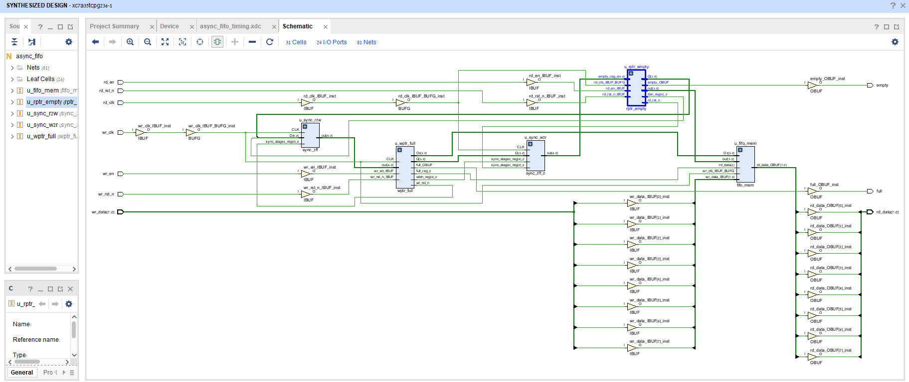
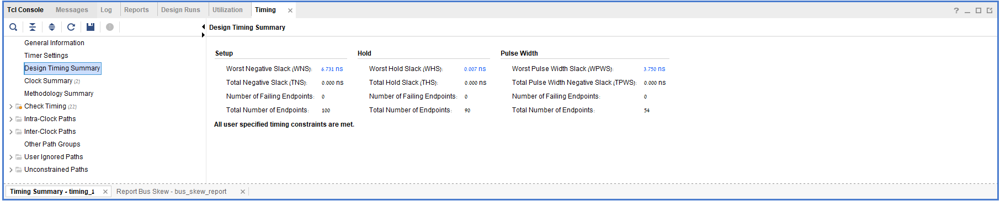
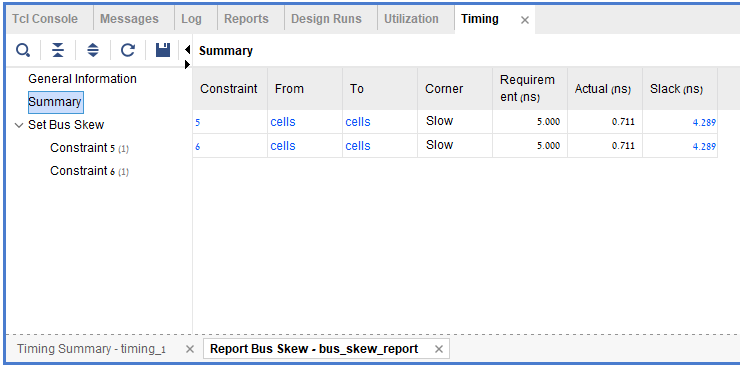
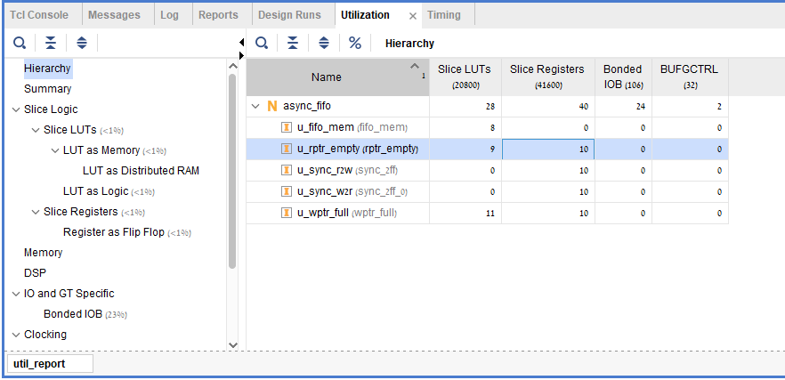
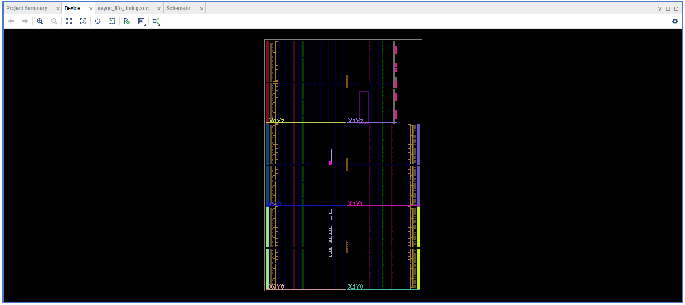

<p align="center">
  
</p>

<h1 align="center">Asynchronous FIFO - Gray-Code CDC Design</h1>

<p align="center">
  <b>Dual-Clock Asynchronous FIFO with Gray-Code CDC · SystemVerilog · AMD Artix-7</b><br/>
  <sub>Hardware Design Portfolio &middot; Fully Constrained &middot; Zero Timing Violations &middot; Scoreboard-Verified</sub>
</p>

<p align="center">
  
  
  
  
</p>

---

## Table of Contents

- [Overview](#overview)
- [Architecture](#architecture)
- [Design Parameters](#design-parameters)
- [CDC Strategy](#cdc-strategy)
- [Module Hierarchy](#module-hierarchy)
- [Timing Constraints](#timing-constraints)
- [Implementation Results](#implementation-results)
- [Testbench Verification](#testbench-verification)
- [Repository Structure](#repository-structure)
- [Getting Started](#getting-started)
- [License](#license)

---

## Overview

This project implements a **fully asynchronous dual-clock FIFO** based on the classic Cummings/Alfke Gray-code pointer technique ([Simulation and Synthesis Techniques for Asynchronous FIFO Design, SNUG 2002](http://www.sunburst-design.com/papers/CummingsSNUG2002SJ_FIFO1.pdf)). The design safely transfers data between two unrelated clock domains - a **100 MHz write domain** and a **40 MHz read domain** - using Gray-coded pointer synchronization through 2-stage flip-flop chains.

**Key highlights:**

| Feature | Detail |
|:---|:---|
| Data Width | 8 bits (parameterizable) |
| FIFO Depth | 16 entries (2<sup>4</sup>, parameterizable) |
| Read Latency | 0 cycles (First-Word Fall-Through) |
| Memory Type | Distributed RAM (LUT-based) |
| CDC Method | Gray-code + 2-FF synchronizer |
| Target FPGA | AMD Artix-7 `xc7a35tcpg236-1` |
| Timing Result | **0 failing endpoints** — fully timing-clean |

---

## Architecture

```
                      ┌────────────────────────────────────────────────────────────────────────┐
                      │                            async_fifo (top)                            │
                      │                                                                        │
   wr_clk domain      │                                                        rd_clk domain   │
  ─────────────────   │                                                      ───────────────── │
                      │                                                                        │
  wr_data[7:0] ──────►│─────────────────────────────┐                                          │
  wr_en ─────────────►│──────┐                      │                                          │
                      │      ▼                      ▼                                          │
                      │  ┌──────────────┐      ┌──────────────┐      ┌──────────────┐          │
  full ◄──────────────│──┤  wptr_full   │      │   fifo_mem   │      │  rptr_empty  ├───┬──────│──────► empty
                      │  │              │      │ (Dist. RAM)  │      │              │   │      │
                      │  │  waddr [3:0] ├─────►│  16 × 8-bit  │◄─────┤  raddr [3:0] │   │      │
                      │  │              │      │              │      │              │   │      │
                      │  │  wgray [4:0] │      │  sync write  │      │  rgray [4:0] │   │      │
                      │  └──────┬───────┘      │  async read  │      └──────┬───────┘   │      │
                      │         │              └──────┬───────┘             │           │      │
                      │         │                     │                     │           │      │
                      │         │                     └─────────────────────┼───────────┼──────│──────► rd_data[7:0]
                      │         │                                           │           │      │
                      │         │ wptr_gray[4:0]                            │           │      │
                      │         ▼                                           │           │      │
                      │  ┌──────────────┐    (wr_clk → rd_clk)              │           │      │
                      │  │   sync_2ff   ├──────────────────────────────────►│           │      │
                      │  │  (ASYNC_REG) │         wptr_gray_sync[4:0]       │           │      │
                      │  └──────────────┘                                   │           │      │
                      │                                                     │           │      │
                      │  ┌──────────────┐    (rd_clk → wr_clk)              │           │      │
                      │  │   sync_2ff   │◄──────────────────────────────────┘           │      │
                      │  │  (ASYNC_REG) │         rptr_gray[4:0]                        │      │
                      │  └──────┬───────┘                                               │      │
                      │         │                                                       │      │
                      │         └───────────────┐                                       │      │
                      │                         ▼                                       │      │
                      │                   to wptr_full                                  │      │
                      │                                                                 │      │
                      │                                                                 ▼      │
                      │◄────────────────────────────────────────────────────────────────┴──────│◄───── rd_en
                      └────────────────────────────────────────────────────────────────────────┘
```

---

## Design Parameters

| Parameter | Default | Description |
|:---|:---:|:---|
| `DATA_WIDTH` | `8` | Width of each FIFO data word in bits |
| `ADDR_WIDTH` | `4` | Address width; FIFO depth = 2<sup>ADDR_WIDTH</sup> |

**Derived values (at defaults):**

| Derived | Value | Calculation |
|:---|:---:|:---|
| FIFO Depth | 16 | `1 << ADDR_WIDTH` |
| Pointer Width | 5 bits | `ADDR_WIDTH + 1` (extra MSB for full/empty disambiguation) |
| Memory Address | 4 bits | `ADDR_WIDTH` (lower bits of binary pointer) |
| Gray Pointer Width | 5 bits | Same as binary pointer width |

The extra MSB in the pointer allows the design to distinguish between the **full** state (write pointer has wrapped once more than the read pointer) and the **empty** state (both pointers are equal) - a fundamental requirement for correct FIFO operation without an explicit element counter.

---

## CDC Strategy

The Clock Domain Crossing (CDC) strategy follows three key principles:

### 1. Binary-to-Gray Pointer Conversion

Both the write and read pointers are converted from binary to Gray code before crossing clock domains:

$$G = B \oplus (B \gg 1)$$

```systemverilog
// In wptr_full.sv / rptr_empty.sv
assign wgray_next = wbin_next ^ (wbin_next >> 1);
assign rgray_next = rbin_next ^ (rbin_next >> 1);
```

**Why Gray code?** When a Gray-coded counter increments, only **one bit** changes at a time. This eliminates the possibility of a synchronizer capturing an intermediate, glitched multi-bit transition - the worst-case outcome is reading the old value (safe) rather than a corrupt value (catastrophic).

### 2. Two-Stage Flip-Flop Synchronization

Each Gray-coded pointer is passed through a **2-stage flip-flop synchronizer** (`sync_2ff`) in the destination clock domain. The synchronizer registers are annotated with the Xilinx placement attribute:

```systemverilog
(* ASYNC_REG = "TRUE" *) logic [WIDTH-1:0] sync_stage1;
(* ASYNC_REG = "TRUE" *) logic [WIDTH-1:0] sync_stage2;
```

This attribute instructs Vivado to:
- Place both flip-flop stages in the **same slice** (minimizing routing delay)
- Exclude the path from **standard setup/hold timing analysis** (it is covered by `set_max_delay -datapath_only` instead)
- Report the synchronizer in **CDC analysis reports** for audit

### 3. Pessimistic Full/Empty Evaluation

Because synchronized pointers are inherently **stale** (delayed by 2 destination clock cycles), the flag logic is conservatively safe:

| Flag | Condition | Behavior |
|:---|:---|:---|
| **Empty** | `rgray_next == wptr_gray_sync` | May report empty when entries exist → **no data corruption** |
| **Full** | Top 2 MSBs inverted, remaining LSBs match | May report full when space exists → **no overflow** |

```systemverilog
// Full detection (wptr_full.sv) — MSB and MSB-1 inverted
assign full_val = (wgray_next == {~rptr_gray_sync[ADDR_WIDTH:ADDR_WIDTH-1],
                                   rptr_gray_sync[ADDR_WIDTH-2:0]});

// Empty detection (rptr_empty.sv) — exact match
assign empty_val = (rgray_next == wptr_gray_sync);
```

This pessimistic approach guarantees **zero data loss**: the FIFO may momentarily under-report available capacity, but will never allow a write to an actually-full FIFO or a read from an actually-empty FIFO.

---

## Module Hierarchy

| Module | File | Clock Domain | Function |
|:---|:---|:---|:---|
| `async_fifo` | `rtl/async_fifo.sv` | — | Top-level structural interconnect |
| `fifo_mem` | `rtl/fifo_mem.sv` | `wr_clk` (write), async (read) | Distributed RAM storage; sync write, combinational read (FWFT) |
| `wptr_full` | `rtl/wptr_full.sv` | `wr_clk` | Binary/Gray write pointer, full flag generation |
| `rptr_empty` | `rtl/rptr_empty.sv` | `rd_clk` | Binary/Gray read pointer, empty flag generation |
| `sync_2ff` | `rtl/sync_2ff.sv` | Destination clock | Parameterized 2-FF synchronizer with `ASYNC_REG` |

### Memory Implementation

The FIFO memory (`fifo_mem`) is implemented as a **Distributed RAM** (LUT-based) array:

```systemverilog
logic [DATA_WIDTH-1:0] mem [DEPTH];          // Inferred as Distributed RAM

always_ff @(posedge wr_clk)                  // Synchronous write
    if (wr_en && !full) mem[waddr] <= wr_data;

assign rd_data = mem[raddr];                 // Asynchronous (combinational) read
```

The asynchronous read port provides **First-Word Fall-Through (FWFT)** behavior with 0-cycle read latency — the output data is valid combinationally as soon as the read address updates.

---

## Timing Constraints

The XDC constraint file (`constraints/async_fifo_timing.xdc`) defines three categories of timing constraints:

### 1. Clock Definitions

```tcl
create_clock -period 10.000 -name wr_clk -waveform {0.000  5.000} [get_ports wr_clk]  # 100 MHz
create_clock -period 25.000 -name rd_clk -waveform {0.000 12.500} [get_ports rd_clk]  #  40 MHz
```

### 2. CDC Datapath Delay (`set_max_delay -datapath_only`)

These constraints replace standard setup/hold analysis on cross-domain paths. The delay limit is set to the **destination clock period**, guaranteeing that the CDC data arrives well within one destination clock cycle:

| Path Direction | Source | Destination | Max Delay |
|:---|:---|:---|:---:|
| Write → Read | `u_wptr_full/*reg[*]` | `u_sync_w2r/sync_stage1_reg[*]` | **25.0 ns** |
| Read → Write | `u_rptr_empty/*reg[*]` | `u_sync_r2w/sync_stage1_reg[*]` | **10.0 ns** |

### 3. Bus Skew Constraints (`set_bus_skew`)

Critical for **Gray code integrity** - ensures that the arrival-time skew between any two bits of a multi-bit Gray pointer does not exceed one destination clock period. If violated, the synchronizer could capture a state where more than one bit has changed, defeating the Gray code guarantee.

| Bus | Skew Limit |
|:---|:---:|
| Write pointer → Read domain | **5.0 ns** |
| Read pointer → Write domain | **5.0 ns** |

---

## Implementation Results

All results below are from a post-implementation timing analysis on **AMD Artix-7 `xc7a35tcpg236-1`** using Vivado.

### Timing Summary

<p align="center">
  
</p>

| Metric | Value | Requirement | Slack |
|:---|:---:|:---:|:---:|
| **Setup (WNS)** | 3.269 ns | 10.0 ns period | **+6.731 ns** |
| **Hold (WHS)** | 0.007 ns | 0.000 ns | **+0.007 ns** |
| **Failing Endpoints** | **0** | 0 | ✅ |

### Bus Skew Report

<p align="center">
  
</p>

| Metric | Actual | Requirement | Slack |
|:---|:---:|:---:|:---:|
| **Bus Skew** | 0.711 ns | 5.0 ns | **+4.289 ns** |

The substantial positive slack (4.289 ns) confirms that all Gray pointer bits arrive at the synchronizer inputs well within the skew budget, preserving single-bit-change semantics across the CDC boundary.

### Resource Utilization

<p align="center">
  
</p>

| Resource | Used | Available | Utilization |
|:---|:---:|:---:|:---:|
| **Slice LUTs** | 28 | 20,800 | < 0.2% |
| **Slice Registers** | 40 | 41,600 | < 0.1% |
| **LUTs as Memory** | 8 | 9,600 | < 0.1% |
| **BUFGCTRL** | 2 | 32 | 6.25% |

The 8 LUTs used as memory correspond to the 16×8-bit Distributed RAM inferred for the FIFO storage, and the 2 BUFGCTRL buffers drive the two independent clock domains (`wr_clk` and `rd_clk`).

### Device Floorplan

<p align="center">
  
</p>

---

## Testbench Verification

The self-checking testbench (`tb/tb_async_fifo.sv`) employs a **golden-reference scoreboard** pattern to verify end-to-end data integrity across the asynchronous clock domains.

### Verification Strategy

```
  ┌────────────────┐      ┌──────────────┐      ┌────────────────┐
  │  Write Driver  │─────►│   DUT (FIFO) │─────►│  Read Checker  │
  │  (wr_clk)      │      │              │      │  (rd_clk)      │
  └───────┬────────┘      └──────────────┘      └───────┬────────┘
          │                                             │
          │           ┌──────────────────┐              │
          └──────────►│ expected_queue[$]│◄─────────────┘
                      │  (Scoreboard)    │  pop_front & compare
                      └──────────────────┘
```

Every write pushes data into both the DUT and a SystemVerilog dynamic queue (`expected_queue[$]`). Every read pops from the queue and compares against the DUT output. Any mismatch increments `error_count` and triggers `$error`.

### Test Scenarios

| # | Scenario | What it Verifies |
|:---:|:---|:---|
| 1 | **Fill to Full + Overflow** | Writes 16 entries (full depth), then attempts 2 additional writes while `full=1`. Verifies the `full` flag blocks writes and no data corruption occurs. |
| 2 | **Drain to Empty + Underflow** | Reads all 16 entries, validates each against the scoreboard, then attempts a read while `empty=1`. Verifies the `empty` flag blocks reads. |
| 3 | **Concurrent Async R/W** | `fork`-`join` block: 30 writes at 2× `wr_clk` rate and 30 reads at 1× `rd_clk` rate execute simultaneously with a 3-cycle read offset. Tests real-world CDC operation under sustained throughput. |
| — | **Residual Drain** | After the concurrent phase, any remaining elements in the scoreboard are drained and verified to ensure no data was lost during the async stress test. |

### Key Testbench Features

- **Backpressure-aware writes**: The `write_data` task polls `full` and stalls when the FIFO cannot accept data
- **Overflow protection test**: `test_overflow_write` deliberately writes while `full=1` to confirm data is not corrupted
- **Underflow protection test**: Reads while `empty=1` are logged and verified to produce no side effects
- **Automatic pass/fail reporting**: Final `$display` reports `TEST PASSED` or `TEST FAILED` with mismatch count
- **CDC settling guards**: `repeat(5)` clock cycle delays after flag-dependent transitions allow synchronizer latency to settle

---

## Repository Structure

```
async-fifo-project/
│
├── rtl/                              # Synthesizable RTL source files
│   ├── async_fifo.sv                 # Top-level structural module
│   ├── fifo_mem.sv                   # Distributed RAM (16×8) with FWFT read
│   ├── wptr_full.sv                  # Write pointer + Gray conversion + full flag
│   ├── rptr_empty.sv                 # Read pointer + Gray conversion + empty flag
│   └── sync_2ff.sv                   # Parameterized 2-FF synchronizer (ASYNC_REG)
│
├── tb/                               # Verification
│   └── tb_async_fifo.sv             # Self-checking testbench with scoreboard
│
├── constraints/                      # FPGA implementation constraints
│   └── async_fifo_timing.xdc        # Clock definitions, CDC max_delay, bus_skew
│
├── docs/                             # Implementation evidence & reports
│   ├── schematic.png                 # Vivado elaborated schematic
│   ├── timing_summary.png           # Post-implementation timing summary
│   ├── bus_skew.png                  # Bus skew analysis report
│   ├── Utilization.png              # Resource utilization breakdown
│   └── device.png                    # Artix-7 device floorplan view
│
└── README.md                         # This file
```

---

## Getting Started

### Prerequisites

- **AMD Vivado** 2023.1+ (or any version supporting Artix-7)
- SystemVerilog simulation support (Vivado Simulator, ModelSim, or Xcelium)

### Simulation (Behavioral Verification)

Run the self-checking testbench in **batch mode** using the Vivado simulator:

```bash
# Navigate to the project directory
cd async-fifo-project

# Launch Vivado in batch mode for simulation
vivado -mode batch -source - <<'EOF'
  create_project -in_memory -part xc7a35tcpg236-1

  # Add design sources
  add_files -fileset sim_1 {rtl/async_fifo.sv rtl/fifo_mem.sv rtl/wptr_full.sv rtl/rptr_empty.sv rtl/sync_2ff.sv}
  add_files -fileset sim_1 {tb/tb_async_fifo.sv}

  # Set top-level testbench
  set_property top tb_async_fifo [get_filesets sim_1]
  set_property top_lib xil_defaultlib [get_filesets sim_1]

  # Run behavioral simulation
  launch_simulation
  run all
  close_sim
EOF
```

Expected output:
```
--- SCENARIO 1: Basic Fill to Full & Overflow Test ---
[READ MATCH] ...
--- SCENARIO 2: Read to Empty & Underflow Test ---
[READ MATCH] ...
--- SCENARIO 3: Concurrent Asynchronous Write & Read ---
[READ MATCH] ...
==========================================
>> TEST PASSED: All checks and CDC boundaries verified cleanly! <<
==========================================
```

### Synthesis & Implementation (FPGA Build)

Generate a bitstream targeting the Artix-7 in batch mode:

```bash
vivado -mode batch -source - <<'EOF'
  # Create project
  create_project async_fifo_build ./build -part xc7a35tcpg236-1 -force

  # Add RTL sources
  add_files {rtl/async_fifo.sv rtl/fifo_mem.sv rtl/wptr_full.sv rtl/rptr_empty.sv rtl/sync_2ff.sv}
  set_property top async_fifo [current_fileset]

  # Add timing constraints
  add_files -fileset constrs_1 {constraints/async_fifo_timing.xdc}

  # Run full implementation flow
  launch_runs synth_1 -jobs 4
  wait_on_run synth_1

  launch_runs impl_1 -to_step write_bitstream -jobs 4
  wait_on_run impl_1

  # Open implementation and report results
  open_run impl_1
  report_timing_summary -file build/timing_summary.rpt
  report_utilization     -file build/utilization.rpt
  report_bus_skew        -file build/bus_skew.rpt

  puts "Build complete. Check build/ for reports."
EOF
```

### Quick Checks After Build

```bash
# Verify zero timing violations
grep "All user specified timing constraints are met" build/timing_summary.rpt

# Check bus skew slack
grep "set_bus_skew" build/bus_skew.rpt
```

---

## License

This project is provided as-is for educational and portfolio purposes. Feel free to use, modify, and distribute.

---

<p align="center">
  <sub>Designed with ❤️ for reliable clock domain crossing</sub>
</p>
